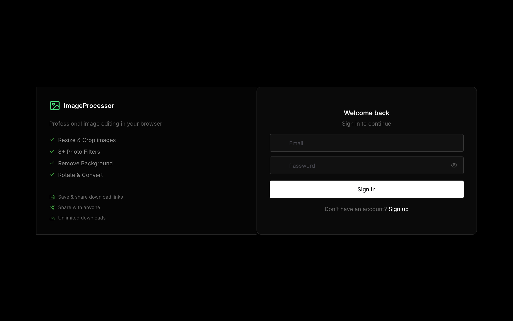
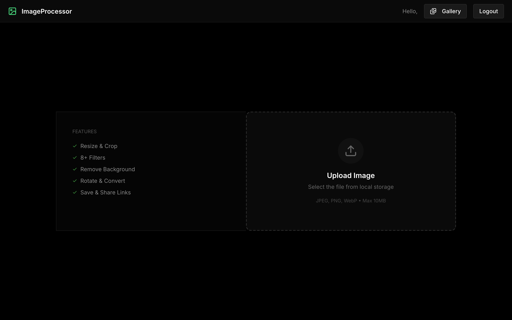
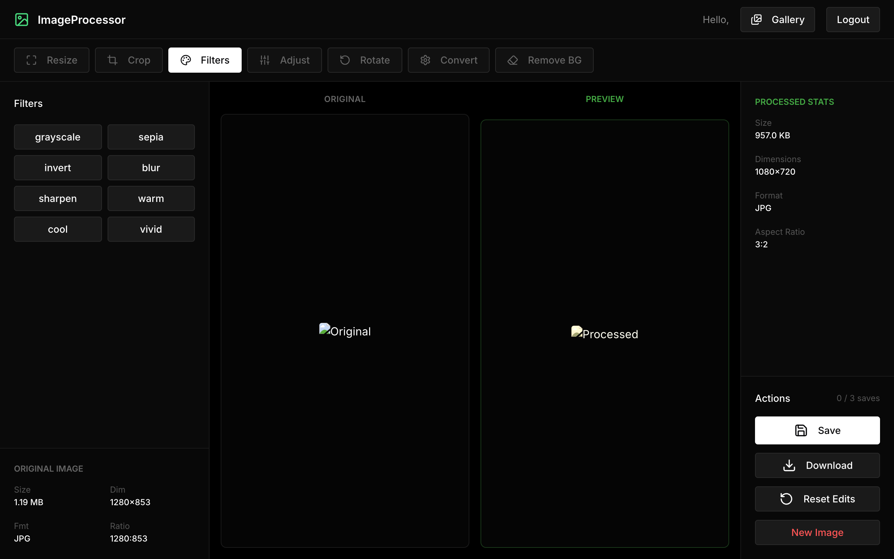
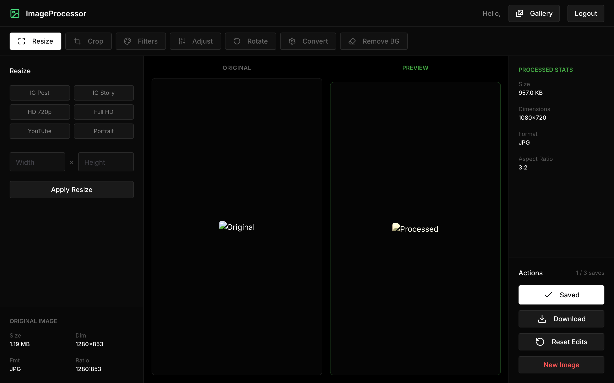

# ImageProcessor

A fully-featured, high-performance web application for professional image editing directly in your browser. Whether you need to quickly resize, crop, filter, or remove backgrounds, ImageProcessor offers a comprehensive suite of tools packed into a dark, sleek, and minimalist UI.

## Features Implemented

* **Secure Authentication:** Full JWT-auth protected endpoints with custom Login and Signup pages routing through React Router.
* **Complete Editing Suite:** Rotate, crop (with presets constraint logic), resize, and format conversion.
* **Photo Filters:** 8+ one-click image filters allowing instant styles (e.g. Grayscale, Sepia, Invert, Blur, Sharpen, Vivid, etc.)
* **Background Removal:** Seamless background removal built right in.
* **State of the Art Design:** A modern dark-mode experience with Chakra UI, Lucide Icons, and Framer Motion layout animations.
* **Secure Saves & Links:** Integrates with backend storage (MongoDB and Azure Blob) to keep track of edited images and provide shareable links.

---

## Application Previews

### 1. Robust Account & Security Flow
*Features modern login UI components, comprehensive validations, and a smooth UX using custom toggle states.*

### 2. Uploading an Image
*Sleek dropzone interface to securely load images into the processor.*

### 3. Editing Workspace
*Realtime previewing with filters, adjusters, cropping constraints, and rotation tools.*

### 4. Saved & Managed Screen
*Visual confirmation, stat updating, download capability, and save limits integration.*

---

## Tech Stack

* **Frontend Engine:** React 19 + Vite (Ultra Fast HMR)
* **Routing:** React Router v7
* **Styling Framework:** Chakra UI
* **Icons:** Lucide React
* **Backend:** Node.js, Express, MongoDB (Mongoose)

## Getting Started

1. Set up the environment variables (e.g., `VITE_API_URL` for frontend).
2. Start the Backend API.
3. Start the Frontend via `npm run dev` and navigate to `http://localhost:5174`.

---

*Redefining browser-based workflows.*
